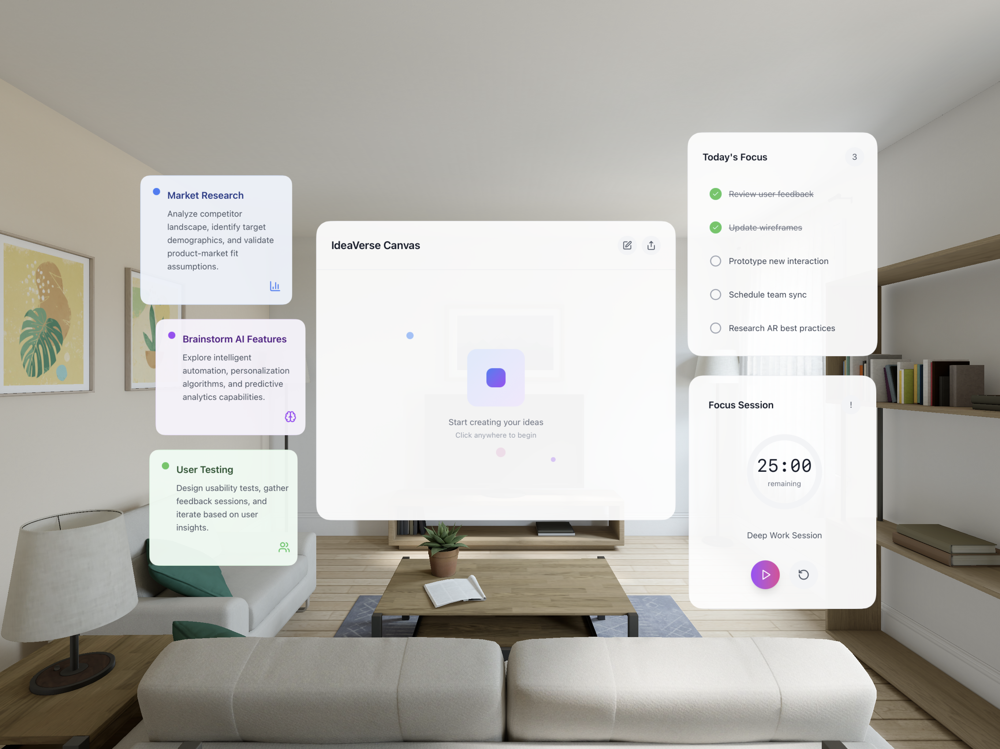

## Project Overview

IdeaVerse is an productivity application that transforms traditional task management into an engaging spatial experience. Built with React, TypeScript and Webspatial, it features a 3D-layered interface where users can organize tasks, track focus sessions, and collaborate on ideas through an interactive canvas.

This app was build within the Web To Spatial program.



*Ideaverse running on Apple Vision Pro Simulator*

## Features

### 3D Task Management
Interactive 3D task cards with color-coded categories, spatial organization, and intuitive editing controls.


*Task creation and editing interface with color selection and 3D positioning*

### Focus & Productivity
**Focus Panel**: Daily task management with completion tracking and inline editing.
**Pomodoro Timer**: 25-minute focus sessions with circular progress visualization and session controls.


*Daily focus management with task completion tracking*


*Pomodoro timer with circular progress visualization*

### Interactive Canvas
Real-time whiteboard with customizable brush tools, color selection, and eraser mode for collaborative ideation.


*Interactive drawing canvas with brush tools and color picker*


## Technology Stack

- **XR Support**: WebSpatial SDK for extended reality features
- **Frontend**: React 18, TypeScript
- **Styling**: Tailwind CSS, CSS 3D Transforms
- **UI Components**: Radix UI primitives
- **Icons**: Lucide React
- **Build Tool**: Vite


## Prerequisites

- Node.js 18+ 
- npm or yarn package manager
- Modern browser with WebGL support
- Apple Vision Pro or Macbook with AVP simulator

## Installation & Setup

1. **Clone the repository**
   ```bash
   git clone https://github.com/liliangisellyps/Ideaverse-WebSpatial
   cd "IdeaVerse-WebSpatial
   ```

2. **Install dependencies**
   ```bash
   npm install
   ```

3. **Start development server**
   ```bash
   npm run dev
   ```

4. **Open in browser**

   Navigate to `http://localhost:3000`

5. **Start XR development server**
  ```bash
    npx webspatial-builder run --base=http://localhost:3000/webspatial/avp/
  ```

6. **Access XR app**

Wait for Apple Vision Pro Simulator to start or access `http://localhost:3000/avp`


## Project Structure

```
src/
├── components/
│   ├── ui/                 # Reusable UI components
│   ├── TaskCard.tsx        # 3D task card component
│   ├── FocusPanel.tsx      # Daily focus management
│   ├── EnhancedTimerPanel.tsx # Pomodoro timer
│   └── EnhancedCanvasPanel.tsx # Collaborative canvas
├── styles/
│   └── globals.css         # Global styles and themes
├── App.tsx                 # Main application component
└── main.tsx               # Application entry point
```


## License

Source code is for study and reference only. Use, modification, or distribution requires author permission.


## Demo & Screenshots


*Complete application demo showing all features in action*


*Comprehensive feature showcase highlighting key functionality*

---